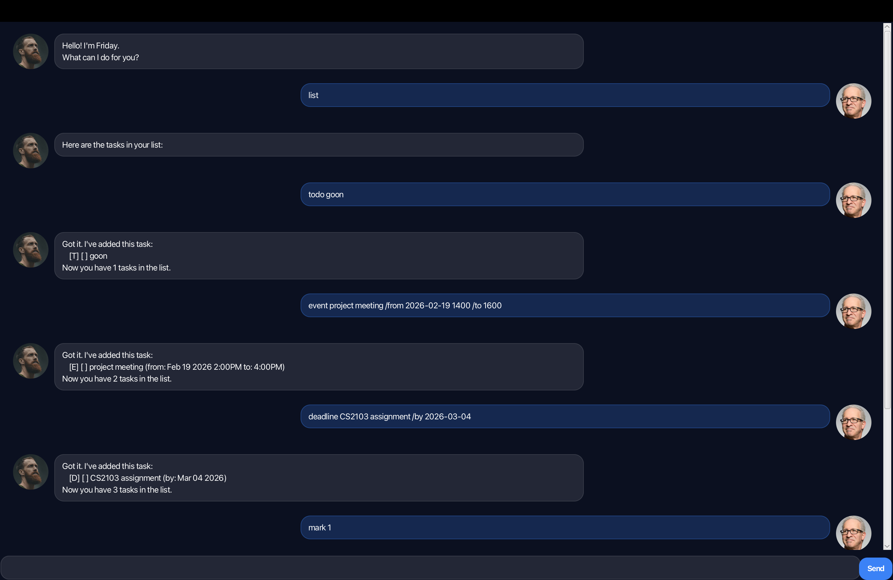

# Friday User Guide



Friday is a task-management chatbot designed to help users manage 3 different types of tasks, ToDos, Deadlines and Events

## Adding todos

Adds a todo task to the task list.

Example: `todo return book`

A new ToDo task with the given description will be added to the list.
```
Got it. I've added this task:
    [T][] return book
Now you have 1 tasks in the list.
```

## Adding deadlines

Adds a task that must be completed before a certain date.

Example: `deadline submit assignment /by 2026-02-19`

A new Deadline task will be added with the specified due date.
```
Got it. I've added this task:
    [D][] submit assignment (by: Feb 19 2026)
Now you have 2 tasks in the list.
```

## Adding events

Adds a task that has a date, starting time and ending time

Example: `event project meeting /from 2026-02-19 1400 /to 1600`

A new Event task will be added with the specified start and end time.
```
Got it. I've added this task:
    [E][] project meeting (from: Feb 19 2026 2:00PM to: 4:00PM)
Now you have 3 tasks in the list.
```

## Printing list

Displays the current list of tasks to the user.

Example: `list`

All tasks currently stored will be displayed in numbered order.
```
Here are the tasks in your list:
1. [T][] return book
2. [D][] submit assignment (by: Feb 19 2026)
3. [E][] project meeting (from: Feb 19 2026 2:00PM to: 4:00PM)
```

## Marking a task as done

Marks a task as completed based on its index in the list.

Example: `mark 2`

The task at the specified index will be marked as done.
```
Nice! I've marked this task as done:
    [D][X] submit assignment (by: Feb 19 2026)
```

## Unmark a task 

Marks a task we previously marked as completed to be not completed.

Example: `unmark 2`

The task at the specified index will be marked as not done.
```
OK, I've marked this task as not done yet:
    [D][] submit assignment (by: Feb 19 2026)
```

## Delete a task

Removes a task from the list of tasks.

Example: `delete 2`

The task at the specified index will be removed from the list.
```
Noted. I've removed this task:
    [D][] submit assignment (by: Feb 19 2026)
Now you have 2 tasks in the list.
```

## Find a task

Displays task in the list with similar descriptions.

Example: 
`todo return jacket`
`find return`

All tasks containing the given keyword will be displayed.
```
Here are the matching tasks in your list:
1. [T][] return book
2. [T][] return jacket
```

## Reminders

Reminds the user of upcoming tasks within the next specified number of days.

Example: 
`deadline something /by 2026-02-25`
`remind 7`

All tasks due within the specified number of days will be displayed.
```
Here are your upcoming tasks in the next 7 days:
1. [D][] something (by: Feb 25 2026)
```